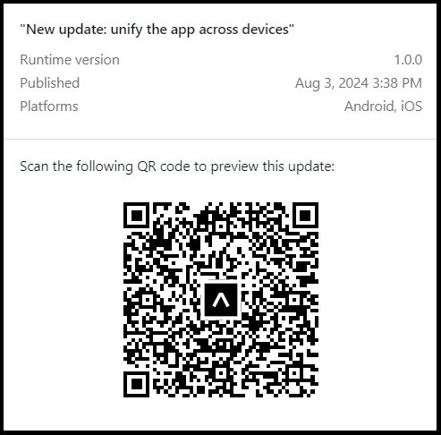

# AIChain Contracts

## Project Description

AI-Chain-Contracts is a platform developed in collaboration with IBM as a dissertation project at King's College London. It is experimental software designed to leverage Generative AI and smart contract technology to automate and secure employment interactions.

## Software Description

AI-Chain-Contracts uses a fine-tuned model of OpenAI's GPT-3.5 Turbo to convert traditional legal employment contracts into smart ones. The backend is built using the Django Rest Framework, providing a robust environment for handling data processing and interactions with the AI model. The user interface is developed with React Native for both iOS and Android devices.

## Key Features

- **Contract Conversion:** Automatically transforms traditional employment contracts into smart contracts using AI.
- **User Authentication:** Secure account creation and management for both employers and employees.
- **Contract Management:** Allows users to create, view, update, and delete smart contracts.
- **Salary Management:** Facilitates salary payments using USDC Coin.
- **Notifications:** Keeps users informed about contract updates, salary payments, and other important events.
- **Performance Metrics:** Supports the input and management of job-related performance metrics.
- **Admin Panel:** Provides an efficient backend management interface for system administrators.
- **Dispute Resolution:** Offers mechanisms to resolve disputes based on contract terms.
- **Custom Theming:** Supports dark and light modes for the user interface.
- **Scalability and Security:** Ensures the system can handle a growing number of users and contracts securely.

## Technology Stack

- **Backend:** Django Rest Framework
- **Frontend:** React Native + Expo
- **AI Model:** OpenAI's GPT-3.5 Turbo
- **Smart Contracts:** Solidity
- **Database:** PostgreSQL
- **Notifications:** Redis Server
- **Encryption:** Nginx for HTTPS and WSS
- **Testing:** Pytest and Jest + GitHub Actions CI/CD pipeline
- **Deployment:** Google Cloud Platform and Expo SDK
- **Containerisation:** Docker 

## Objectives and Benefits

AI-Chain-Contracts aims to offer a reliable, efficient, and secure platform for managing and enforcing employment contracts. By automating the conversion process and ensuring secure transactions through blockchain technology, the platform raises transparency and trust between employers and employees. The use of stable cryptocurrencies like USDC Coin for salary payments minimises financial risks, making it a practical solution for modern employment management.

This project lays the groundwork for future advancements, including the integration of more complex job-specific performance metrics and the expansion of smart contract applications in various employment scenarios. The ultimate goal is to provide a comprehensive solution that addresses the current shortcomings in employment management and promotes fair and transparent interactions in the digital employment market.

## Test Usage

Scan the QR code to render the app:



Alternatively, you can use this link:

```
https://expo.dev/preview/update?message=New%20update%3A%20unify%20the%20app%20across%20devices&updateRuntimeVersion=1.0.0&createdAt=2024-08-03T14%3A38%3A52.572Z&slug=exp&projectId=032f6af8-bb36-47b5-80a0-f6f070705b75&group=e0b07c3c-0576-44ea-be88-aef4dbfc942a
```

If you would like to deploy locally, globally, or redeploy the production server and frontend, please navigate to the backend and frontend folders. Their README files will guide you through the process.